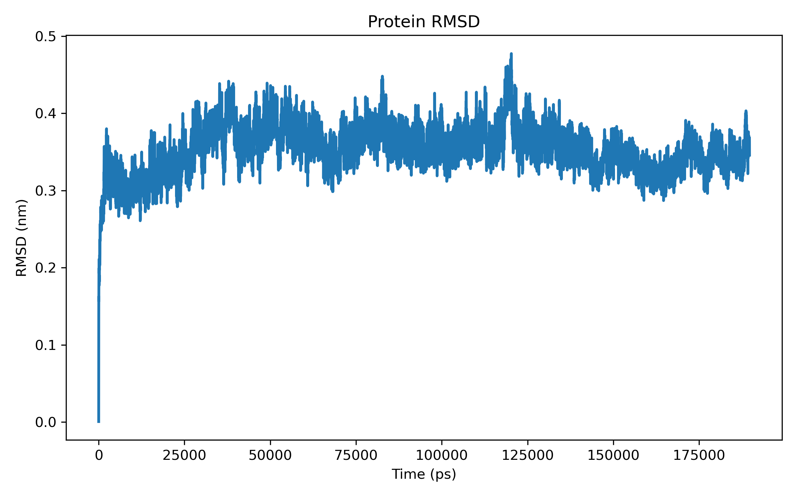
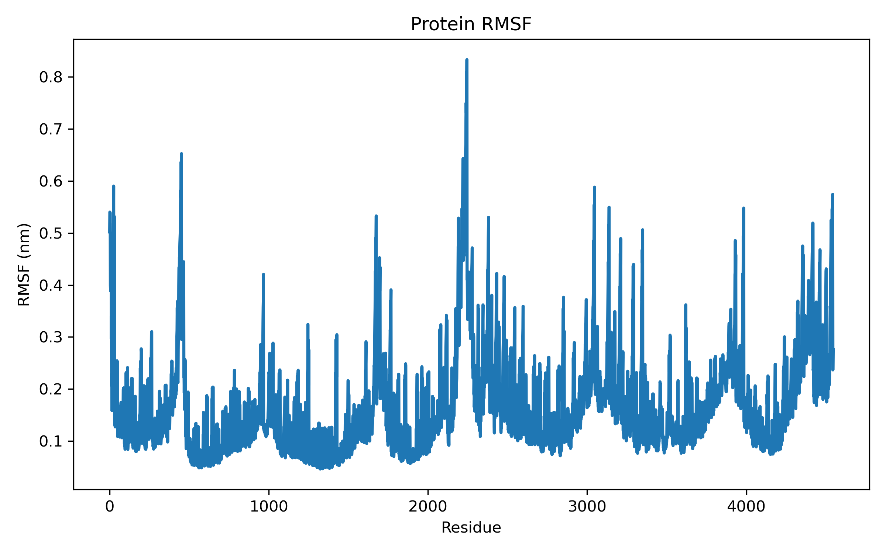
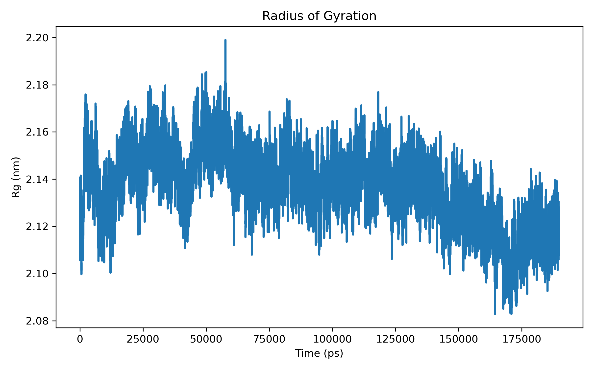
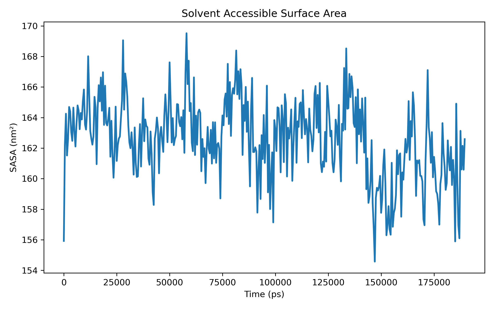

# 🧬 Dynastra

[](https://www.python.org/)
[](https://www.gromacs.org/)
[](LICENSE)
[]()

**Dynastra** is an open-source Python toolkit for **automated molecular dynamics (MD) simulation analysis, visualization, and reporting using GROMACS**.

It aims to simplify post-processing of MD trajectories by automating common analyses, generating publication-ready figures, and providing reproducible workflows for computational biology, structural biology, and drug discovery.

---

# 🚀 Features

## Current Features (v0.1)

✅ Root Mean Square Deviation (RMSD)

✅ Root Mean Square Fluctuation (RMSF)

✅ Radius of Gyration (Rg)

✅ Solvent Accessible Surface Area (SASA)

✅ Automatic Plot Generation

✅ End-to-End Analysis Workflow

---

# 🎯 Why Dynastra?

Molecular dynamics post-processing often requires running multiple GROMACS commands manually and creating plots separately.

Dynastra provides:

- Automated trajectory analysis
- Publication-ready visualizations
- Reproducible workflows
- Python API for customization
- Easy integration with AI/ML pipelines
- Future support for automated reporting

---

# 📂 Project Structure

```text
Dynastra
├── dynastra/
│   ├── rmsd.py
│   ├── rmsf.py
│   ├── rg.py
│   ├── sasa.py
│   ├── plotting.py
│   └── cli.py
│
├── docs/
│   └── images/
│
├── examples/
│   └── test1/
│
├── outputs/
├── tests/
├── README.md
├── requirements.txt
├── setup.py
└── run_analysis.py
```

---

# ⚙️ Installation

## Clone Repository

```bash
git clone https://github.com/priyashamaitra21-maker/Dynastra.git
cd Dynastra
```

## Create Conda Environment

```bash
conda create -n dynastra python=3.12
conda activate dynastra
```

## Install Dependencies

```bash
pip install -r requirements.txt
```

---

# 🧪 Usage

Place your GROMACS trajectory files inside:

```text
examples/test1/
```

Required files:

```text
md.tpr
md.xtc
```

or

```text
md.tpr
md_NJ.xtc
```

Run:

```bash
python run_analysis.py
```

Generated outputs will be written to:

```text
outputs/
```

---

# 📈 Example Outputs

| RMSD | RMSF |
|------|------|
|  |  |

| Radius of Gyration | SASA |
|------|------|
|  |  |

---

# 🔬 Planned Features

## Version 0.2

- Hydrogen Bond Analysis
- Principal Component Analysis (PCA)
- Free Energy Landscape (FEL)
- Clustering Analysis

## Version 0.3

- MM/PBSA Calculations
- Protein-Ligand Interaction Analysis
- Contact Maps
- Secondary Structure Analysis
- HTML Report Generation

## Version 1.0

- Command Line Interface (CLI)
- Multi-trajectory Analysis
- Parallel Processing
- Jupyter Integration
- Agentic AI-assisted Interpretation
- Automated Report Generation

---

# 💻 Example Workflow

```python
from dynastra.rmsd import calculate_rmsd
from dynastra.rmsf import calculate_rmsf
from dynastra.rg import calculate_rg
from dynastra.sasa import calculate_sasa

tpr = "examples/test1/md.tpr"
xtc = "examples/test1/md_NJ.xtc"

calculate_rmsd(tpr, xtc)
calculate_rmsf(tpr, xtc)
calculate_rg(tpr, xtc)
calculate_sasa(tpr, xtc)
```

---

# 🛣️ Roadmap

### v0.1
- RMSD
- RMSF
- Rg
- SASA

### v0.2
- H-bonds
- PCA
- FEL
- Clustering

### v0.3
- MM/PBSA
- Protein-Ligand Interactions
- Reporting

### v1.0
- Full MD analysis suite
- AI-assisted interpretation
- Publication-ready reports

---

# 🤝 Contributing

Contributions, bug reports, and feature requests are welcome.

Feel free to open:

- Issues
- Pull Requests
- Discussions

---

# 📚 Citation

If you use Dynastra in your research, please cite this repository.

A formal software publication is planned.

---

# 👩‍💻 Author

**Priyasha Maitra**

Bioinformatics & Computational Biology Researcher

🔬 Computational Drug Discovery

🧬 Molecular Dynamics Simulations

🤖 AI/ML in Life Sciences

🐍 Scientific Python Development

GitHub:
https://github.com/priyashamaitra21-maker

LinkedIn:
https://www.linkedin.com/in/priyasha-maitra-9618a8186/

---

